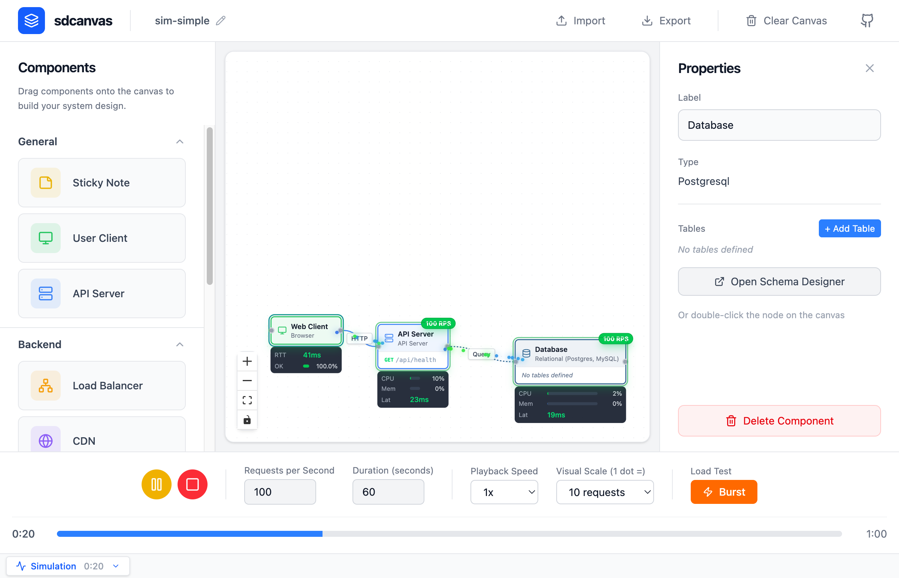

# `sdcanvas`

[](https://github.com/tommy-xr/sdcanvas/actions/workflows/ci.yml)

**[Try it live at sdcanvas.dev](https://sdcanvas.dev)**

## Overview

System Design Canvas (`sdcanvas`)

This is a drawing tool focused on high-level system architecture - geared towards system design interviews. Think of it like an IDE for system design.



## Development

### Prerequisites

- Node.js (v18+)
- npm

### Setup

```bash
# Install dependencies
npm install

# Start development server
npm run dev
```

### Available Scripts

- `npm run dev` - Start the development server
- `npm run build` - Build for production
- `npm run preview` - Preview the production build
- `npm run lint` - Run ESLint
